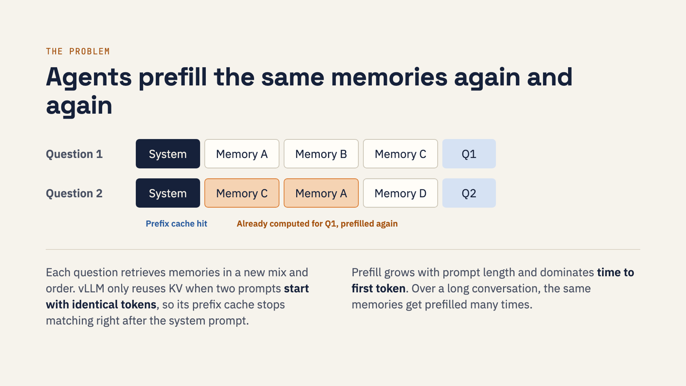
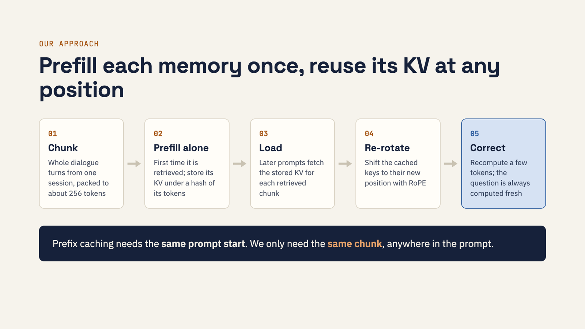
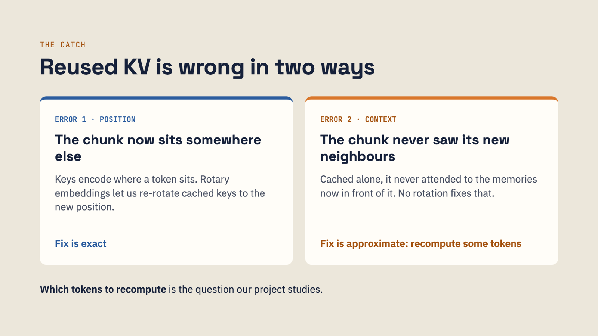
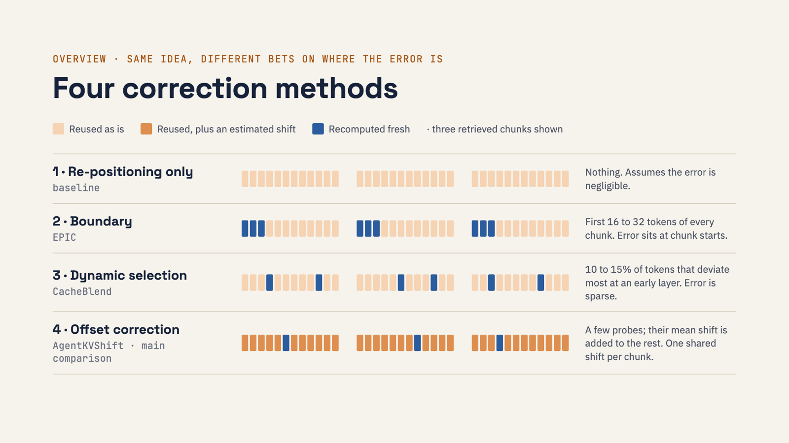

# Prefill once, reuse anywhere


Non-prefix KV cache reuse for memory-augmented LLM agents, built on Hugging Face Transformers
and served through an unmodified vLLM. This is the semester project for CS 6220 Big Data Systems
at Georgia Tech (Fall 2026, Group 7): Atharva Mohite, Teppei Kawashima, Prakhar Langer and
Vishal Puneyani.

**[Slides](https://moriowen.github.io/kvreuse/walkthrough/slides.html)** ·
[Walkthrough](https://moriowen.github.io/kvreuse/walkthrough/) ·
[Proposal (PDF)](Group7-proposal-nonprefix-kv-reuse-agent-memory.pdf) ·
[Concept guide](concept-guide.md)

## The problem

A chat agent that talks with someone for months can't fit the whole history in its context
window. Systems like MemGPT and A-Mem save the conversation as memory entries instead. When a
question arrives, a retriever picks the few most relevant entries and the agent pastes them into
the prompt ahead of the question.

Before the model writes its first token it has to run *prefill*: one pass over every prompt
token that produces a key and a value vector per token per layer (the KV cache). Prefill cost
grows with prompt length, and it dominates time to first token (TTFT). For Mistral-7B the KV
cache is 128 KB per token.

Serving engines already avoid some of that work. vLLM's prefix caching and SGLang's
RadixAttention reuse KV blocks between requests, but only when the requests **start with
identical tokens**. Memory retrieval breaks that condition all the time:



Question 2 needs memories C and A, which were computed seconds earlier for question 1. They
moved, so the prefix cache misses them and they get prefilled again. Over a long conversation
the same memories are prefilled many times.

## The approach



We treat each memory entry as a chunk: whole dialogue turns from one session, packed to about
256 tokens and never split mid-turn. The first time a chunk is retrieved we prefill it on its
own and store its KV under a hash of its tokens. Later prompts that contain the chunk load that
KV, wherever the chunk lands. The question at the end is always computed fresh.

Reused KV is wrong in two ways, though:



1. **Position.** Mistral uses rotary position embeddings (RoPE), so a cached key encodes where
   its token sat. Rotations compose, so one extra rotation by the position difference moves a
   key to its new place exactly. We do this in fp32 and cast once.
2. **Context.** A chunk cached alone never attended to the chunks now in front of it, so its KV
   above the first layer is slightly off. No rotation fixes that. The only fix is to recompute
   some of its tokens against the assembled cache.

Which tokens to recompute is what the project studies. We compare four published answers, all
plugged into the same per-layer recompute loop and charged by the same budget formula:



| # | Method | Recomputes | Bets that the error... |
|---|---|---|---|
| 1 | Re-positioning only (baseline) | nothing | is small enough to ignore |
| 2 | Boundary ([EPIC](https://arxiv.org/abs/2410.15332)) | first 16 to 32 tokens of each chunk | sits at chunk starts, where cached-alone chunks form attention sinks |
| 3 | Dynamic selection ([CacheBlend](https://arxiv.org/abs/2405.16444)) | the 10 to 15% of tokens that deviate most at an early layer | is concentrated in a few tokens |
| 4 | Offset correction ([AgentKVShift](https://arxiv.org/abs/2607.21604)) | a few probe tokens, then their mean shift added to the rest | is a shared shift across each chunk |

## Research question

> How much prefill can non-prefix KV reuse remove from a memory-augmented agent, and how do
> different ways of correcting reused KV trade answer quality against prefill cost?

The second half of the project asks whether reuse lowers TTFT and raises throughput when it
is served through unmodified vLLM, and how often memories must repeat before it beats prefix
caching. vLLM can only serve method 1 without engine changes, so the connector plugin serves
that one. Methods 2 to 4 recompute tokens inside the prefix at every layer, which would need
scheduler changes, and editing vLLM is out of scope.

The correction algorithms come from prior work, and we don't propose a new one. What we add is
engineering and evaluation: all four methods compared on one conversational-memory workload
under one cost accounting, an independent reimplementation of AgentKVShift (it has no public
code), and non-prefix reuse served through vLLM's public KV connector API.

## Setup

| | |
|---|---|
| Model | Mistral-7B-Instruct-v0.3, the model AgentKVShift reports on LoCoMo |
| Quality data | [LoCoMo](https://github.com/snap-research/locomo): 10 long multi-session conversations (17K to 31K tokens), 1,986 questions |
| Systems data | synthetic memory pool with Zipf-distributed popularity |
| Retrieval | BM25 top-10, saved to disk once; every run reads the same file |
| Reference | full prefill of the same retrieved prompt; full-context prompt as the quality ceiling |
| Metric | LoCoMo F1 overall and per category, paired and conversation-level bootstrap CIs |
| Hardware | H100 80GB on Georgia Tech's PACE ICE cluster |
| Serving | vLLM 0.27.1, pinned, with an external KV connector plugin |

## Experiments

| ID | Question | Stack |
|---|---|---|
| E0 | Is the implementation correct? Four exact-match checks against full prefill | Transformers |
| E1 | How much quality does each method keep? F1 vs. recompute budget, 0 to 60% | Transformers |
| E2 | How much prefill is removed? Prefill time vs. number of retrieved chunks k | Transformers |
| E3 | Does the connector cut latency? TTFT for full prefill, prefix cache, connector | vLLM |
| E4 | When does reuse beat prefix caching? Throughput and TTFT as reuse goes 0 to 100% | vLLM, Zipf |
| E5 | Does the connector match the reference? Tokens and KV first, then outputs and F1 | vLLM vs. HF |

## Status

| Piece | Status |
|---|---|
| C1 memory pipeline | built, ran on PACE |
| C2 KV store, re-rotation, selective recompute, 4 methods | built |
| E0 correctness gate | **passed** Oct 7: worst max-abs logit error 4.6e-5 vs. a 1e-3 tolerance (20 prompts, fp32) |
| E1 quality sweep, full baselines | running on PACE |
| E2 prefill time vs. k | job list ready |
| C3 vLLM connector | built; E5 match check not run yet |
| C4 Zipf workload, C5 serving benchmark | not built |

First signal from a 100-question smoke run: uncorrected reuse (method 1) drops F1 from 0.244
to 0.129. Separate profiling over 12 prompts (about 2.3K tokens each, H100) puts median prefill
at 78.9 ms for full prefill and 29.9 ms for method 1. Closing that quality gap at a
small recompute budget is what methods 2 to 4 are for, and E1 measures how well each does it.

## Repo layout

```
kvreuse/          the package
  locomo.py         LoCoMo loading and chunking
  retrieval.py      BM25 / embedding retrieval
  prompt.py         token-ID prompt assembly
  store.py          chunk KV store keyed by token hash
  rope.py           RoPE re-rotation
  forward.py        hand-written per-layer forward with selective recompute
  methods.py        the four token-selection methods
  metrics.py        LoCoMo F1
  vllm_connector.py ChunkReuseConnector for vLLM 0.27.1
  connector_logic.py vLLM-free parts of the connector (unit-tested)
scripts/          prepare_data, e0_real, run_eval, analyze, export_store, vllm_e5, profile_prefill
tests/            E0 and connector logic on a tiny random Mistral (CPU, under a second)
pace/             Slurm job scripts for PACE ICE
walkthrough/      slides and walkthrough pages (HTML)
reports/          research review of prior art and vLLM connector internals
```

## Running it

```bash
python3.11 -m venv .venv && .venv/bin/pip install -e '.[dev]'
.venv/bin/python -m pytest                        # CPU, tiny random model
curl -sSL -o data/locomo10.json https://raw.githubusercontent.com/snap-research/locomo/main/data/locomo10.json
python scripts/prepare_data.py --k 10             # chunks + saved top-10 retrievals
python scripts/e0_real.py --n 20                  # E0 gate on the real model (needs a CUDA GPU)
python scripts/run_eval.py --method full          # also: reposition, epic, cacheblend, agentkvshift
python scripts/analyze.py results/*.jsonl --out results/table.md
```

The real model only runs on a GPU node. [AGENTS.md](AGENTS.md) covers the PACE workflow, the
fixed design decisions and the experiment rules.

## Walkthrough

The [`walkthrough/`](walkthrough/) folder is a small static site. GitHub shows HTML files as
source, so open it through the Pages links above or locally in a browser.

| Page | What it covers |
|---|---|
| [slides.html](walkthrough/slides.html) | The 21-slide project check-in deck, with speaker notes |
| [index.html](walkthrough/index.html) | Overview and current status |
| [pipeline.html](walkthrough/pipeline.html) | One LoCoMo question followed from raw conversation to F1 |
| [methods.html](walkthrough/methods.html) | The four methods on an interactive token-by-layer grid |
| [experiments.html](walkthrough/experiments.html) | E0 to E5 and the numbers so far |
| [codebase.html](walkthrough/codebase.html) | Every file, its dependencies, and the PACE job flow |

## References

CacheBlend ([2405.16444](https://arxiv.org/abs/2405.16444)), EPIC
([2410.15332](https://arxiv.org/abs/2410.15332)), AgentKVShift
([2607.21604](https://arxiv.org/abs/2607.21604)), KVCOMM
([2510.12872](https://arxiv.org/abs/2510.12872)), LMCache, LoCoMo. The full list is in the
[proposal](proposal-nonprefix-kv-reuse-agent-memory.md).
